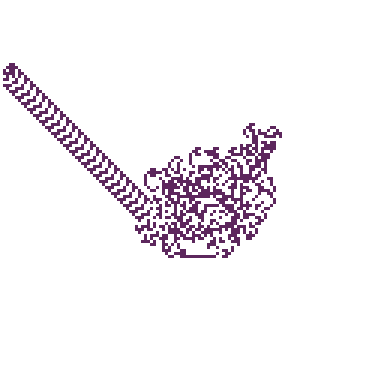
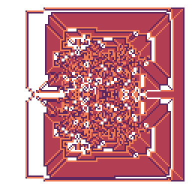
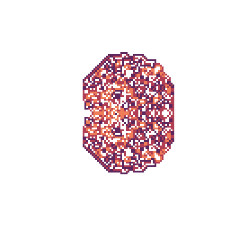
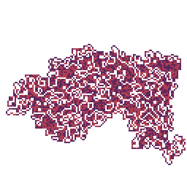
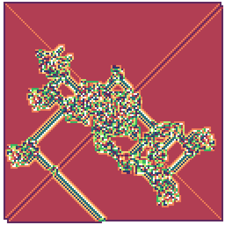

# Langton's Ant

## Description

Simulation of [Langton's Ant](https://en.wikipedia.org/wiki/Langton%27s_ant), a cellular automaton in which
an ant "walks" over a 2D space, acting based on the tile at it's position.

The field is initialized to zeros, and incremented when the ant walks on that tile.
The values wrap around when they hit a given maximum.

The ant then acts based on the value of the tile, either turning right, left, around, or not at all.
The ant then takes a single step "forwards", and the cycle repeats.

This has shown to create interesting patterns which depend on the number of values in the field, and the decision of the ant.
The below examples were created with the default iterations, 128x128 dimensions, and varying patterns.







## Installation

Compilation uses CMake in the standard configuration:

```
mkdir build && cd build
cmake ..
make
./LangtonsAnt
```

CMake should automatically download any missing dependencies: `Raylib` graphics library, `ImGui` and `Raylib-ImGui` UI extensions.
